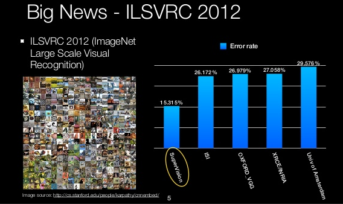
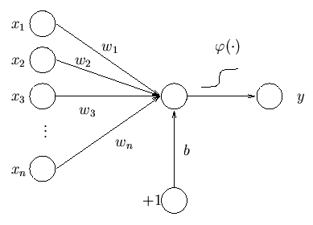
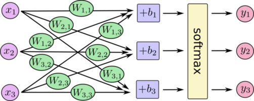
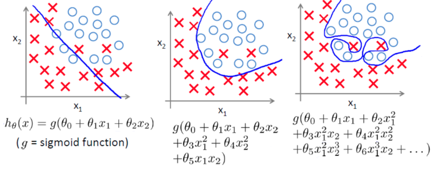
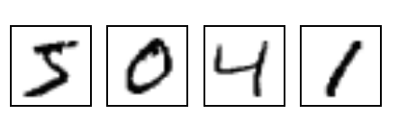
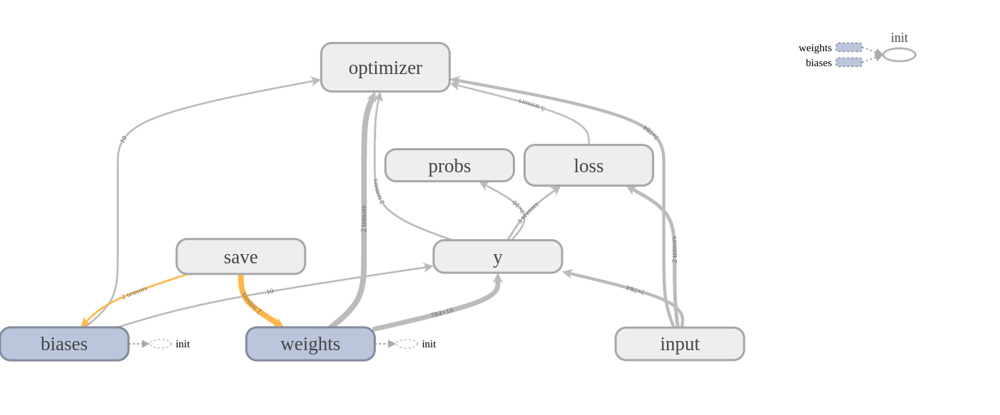
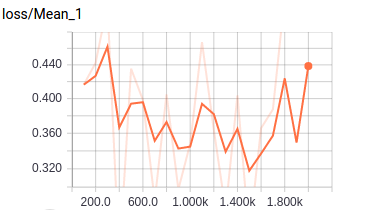
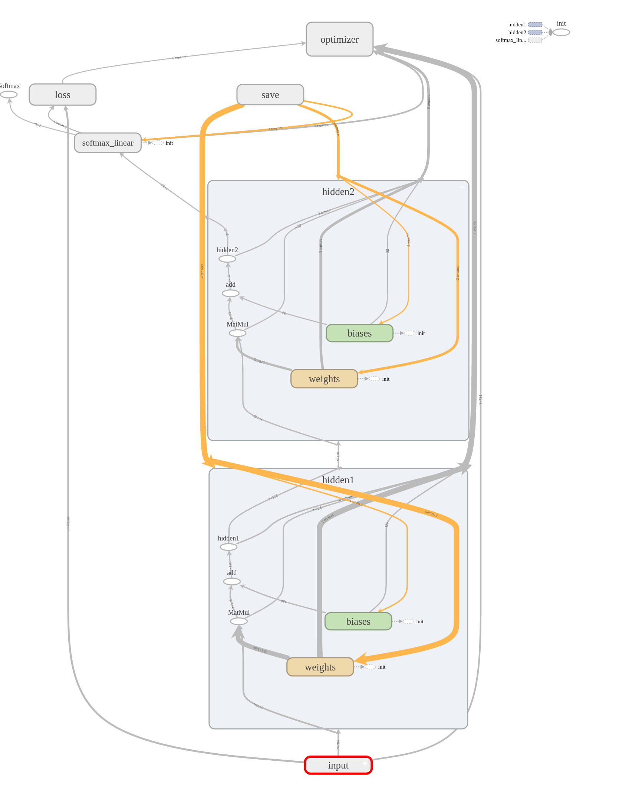

# 基于学习的计算机视觉 （一）：监督学习和神经网络

近几年，人工智能的浪潮席卷了整个科技圈。Google，Facebook，微软，百度等全球最顶尖的科技公司都将目光转向了人工智能，并将之视为今后的战略重心。 随着人脸识别，辅助驾驶，AlphaGo等应用的不断涌现，基于学习的计算机视觉（learning based vision）正在越来越多的改变我们的生活 。本系列文章，将逐步介绍这些看似神奇的系统背后的视觉算法原理。


本文是整个系列的第一篇文章，将会简单介绍一下计算机视觉的发展，以及监督学习、神经网络的基本原理。最后的实践部分，会用TensorFlow给出之前介绍算法的一个简单实现。


## 计算机视觉的发展
什么是计算机视觉？ 首先我们看一下维基百科的定义：
>Computer vision is an interdisciplinary field that deals with how computers can be made for gaining high-level understanding from digital images or videos.

简单来说，计算机视觉就是让机器能自动的理解图片或视频。

计算机视觉的起源可以追溯到1966年，当时MIT著名的工智能专家Marvin Minsky给他的本科学生留了一个暑期作业-“Link a camera to a computer and get the computer to describe what it saw”。 虽然人可以很容易的理解图片，但事实证明，让计算机理解图片远比我们一开始想象的复杂。

早期的计算机视觉研究，由于计算资源和数据的原因，主要集中在几何和推理。 上世纪90年代，由于计算机硬件的不断发展和数字照相机的逐渐普及，计算机视觉进入了快速发展期。 这期间的一大突破是各种人工设计特征的涌现，例如SIFT，HOG等局部特征。 这些特征相对原始像素具有对尺度，旋转等的鲁棒性，因此得到了广泛的应用，催生了如图像拼接、图像检索、三维重建等视觉应用。 另一大突破是基于统计和机器学习的方法的流行。随着数字照片的不断普及，大规模的数据集也相伴而生，基于学习的计算机视觉（Learning based Vision），由于可以通过大量数据自动学习模型参数，渐渐的成为了主流。



随着计算能力的不断进步和海量互联网数据的产生，传统的基于人工特征和SVM/boosting等简单机器学习算法的视觉技术遇到了瓶颈。因此，工业界和学术界都在探索如何避免繁琐的人工特征设计同时加强模型的拟合性能，从而进一步利用海量数据。深度学习很好的满足了这一需求，因此在视觉领域得到了非常广泛的应用。2010年之后，计算机视觉逐渐进入了深度学习的时代。标志性的事件是ImageNet 2012比赛。这次比赛中，基于深度学习的算法大大超过了经过精心设计的传统算法，震惊了整个学术界，进而带动了深度学习在其他领域中的应用。这次比赛也被看成是深度学习在整个人工智能领域复兴的标志性事件。

目前，除了三维重建等low-level vision问题，基于深度学习的算法，在大多数视觉问题上的性能已经远远超过了传统算法，因此本系列文章会重点介绍基于深度学习的计算机视觉算法。


## 神经网络 (neural network)
神经网络（NN），简单来说就是神经元组成的网络，是最早出现，也是最简单的一种深度学习模型。其他很多更复杂的算法比如卷积神经网络，深度增强学习中的许多概念都来源于神经网络。因此，我们在这篇文章中先介绍一下神经网络的原理。 要理解神经网络，我们需要先了解什么是神经元。

### 神经元 & 感知器
神经元（neuron）是神经网络的最小单位。每个神经元将多个入映射到一个输出。如图所示，神经元的输出是输入的加权和加上偏置，再通过一个激活函数。具体可以表示成：

+b)=\varphi(\mathbf{w}\cdot\mathbf{x}+b))



激活函数  有各种不同的形式。如果使用step函数，那神经元等价于一个线性分类器:


这个分类器在历史上被称为感知器（Perceptron）。


### 多层神经网络
单层的感知器只能解决线性可分的问题。但实际中绝大多数问题都是非线性的，这时单层感知器就无能为力了。 为此，我们可以把单个的neuron组成网络，让前一层neuron的输出做为下一层neuron的输入。组成如下图所示的神经网络：


由于非线性激活函数的存在，多层神经网络就有了拟合非线性函数的能力。由于历史的原因，多层神经网络也被称为 multilayer perceptrons（MLP）。

神经网络具有拟合非线性函数的能力。但是为了拟合不同的非线性函数，我们是否需要设计不同的非线性激活函数和网络结构呢？ 答案是不需要。**universal approximation theorem** 已经证明，前向神经网络是一个通用的近似框架。 简单来说，对常用的sigmoid，relu等激活函数，即使只有一层隐藏层的神经网络，只要有足够多的神经元，就可以无限逼近任何连续函数。在实际中，浅层神经网络要逼近复杂非线性函数需要的神经元可能会过多，从而提升了学习的难度并影响泛化性能。因此，我们往往通过使用更深的模型，从而减少所需神经元的数量，提升网络的泛化能力。

## 机器学习的基本概念
深度神经网络是深度学习中的一类算法，而深度学习是机器学习的一种特例。因此，这一节我们在机器学习的一般框架下，介绍模型训练相关的基本概念，及其在Tensorflow中的实现。相关概念适用于包括NN在内的机器学习算法。

### 机器学习的常见问题
常见的机器学习问题，可以抽象为4大类问题:
- 监督学习
- 非监督学习
- 半监督学习
- 增强学习

根据训练数据是否有label，可以将问题分为监督学习（所有数据都有label），半监督学习（部分数据有label）和非监督学习（所有数据都没有label）。 增强学习不同于前3种问题，增强学习也会对行为给出反馈（reward），但关注的是如何在环境中采取一系列行为，从而获得最大的累积回报。监督学习是目前应用最广泛，也是研究最充分的机器学习问题，本文接下来将重点介绍监督学习。

### 监督学习
在监督学习中，给定个训练样本 ,...,(x_N,y_N)\}) ，我们的目标是得到一个从输入到输出的函数： 。实际中，我们通常不会直接优化函数，而是根据问题的具体情况，选择一组参数化的函数 , 将优化函数转换成优化参数 。

常见的分类问题和回归问题，都是监督学习的一种特例。线性分类器，深度神经网络等模型，都是为了解决这些问题设计的参数化后的函数。为了简单，我们以线性分类器 =w^Tx+b)为例，需要优化的参数  为 )。

### 损失函数
为了衡量函数的好坏，我们需要一个客观的标准。 在监督学习中，这个评判标准通常是一个损失函数 。对一个训练样本 )，模型的预测结果为 ，那对应的损失为 )。损失越小，表明函数预测的结果越准确。实际中，需要根据问题的特点，选择不同的损失函数。

二分类问题中，常用的logistic regression采用sigmoid + cross entroy作为loss。对常见的loss，tensorflow都提供了相应的函数。
```
loss = tf.nn.sigmoid_cross_entropy_with_logits(labels=labels, logits=y)
```


对多分类问题，如上图所示，我们可以将二分类的线性分类器进行扩展为个线性方程：。 然后通过 _i=\frac{\exp(x_i)}{\sum_j\exp(x_j)}) 进行归一化，归一化后的结果作为每一类的概率。因此，多分类通常使用 softmax + cross entropy作为损失函数。
```
loss = tf.nn.softmax_cross_entropy_with_logits(labels=labels, logits=logits)
```
可以证明，对于二分类问题，采用sigmoid cross entroy和softmax cross entory作为loss，在理论上是完全等价的。此外，实际中通常采用直接计算softmax cross entropy而不是先计算softmax，后计算cross entory，这主要是从数值稳定性的角度考虑的。


#### 损失最小化和正则项
在定义了损失函数之后，监督学习问题可以转化为最小化实验损失 )) 。实际中，为了保证模型的拟合能力，函数的复杂度有时会比较高。如最图中最右边情况所示，如果训练样本数较少或者label有错误时，直接最小化实验损失而不对加限制的话，模型容易过拟合。


因此，在样本数量较少或者标注质量不高的情况下，需要额外添加正则项（regularizer），保证模型的泛化能力。实际中根据不同需求，可以选择不同的正则项。在神经网络当中，比较常见的是l2 norm正则项： =\frac{1}{2}\sum_{i=1}^{n}w_i^2)

在tensorflow中，通常有两种方法添加正则项。一种是根据需要，自己实现相应的regularization loss，然后和其他loss相加进行优化。这种方法可以实现比较复杂的regularizer。
```
weight_decay = tf.multiply(tf.nn.l2_loss(weights), wd, name='weight_loss')
```

对于常见的正则项，也可以使用tensorflow自带的功能，对相应的变量进行正则化。然后将系统生成的所有regularization loss和其他loss相加进行优化。
```
tf.contrib.layers.apply_regularization(tf.contrib.layers.l2_regularizer(wd), weights)
tf.losses.get_regularization_losses()
```

#### 梯度下降和反向传播
在定义了损失函数和正则项之后，最终正则化后的loss为： =\frac{1}{n}\sum_{i=1}^{n}L(y_i,f(x_i))+\alpha{R(w)})

有了loss函数，相应的参数可以通过标准的梯度下降算法进行优化求解。例如对线性分类器中的，可以通过如下的公式进行迭代更新：
}}{\partial{w}}+\frac{\partial{L(w^Tx_i+b,y_i)}}{\partial{w}}))

通过设定合适的learning rate，参数会逐步收敛到局部/全局最优解。

反向传播可以看成梯度下降在神经网络中的一个推广，也是通过最小化loss函数，计算参数相对于loss的梯度，然后对参数进行迭代更新。具体的推导因为篇幅原因在这里略过了。在tensorflow中，只需要指定loss函数和步长（learning rate），optimizer可以自动帮我们完成梯度下降/反向传播的过程：
```
tf.train.GradientDescentOptimizer(learning_rate).minimize(loss)
```

## OCR 实战
最后本文通过一个OCR的例子，展示如何用Tensorflow实现Softmax分类器和MLP分类器。实验数据集采用著名的数字识别数据集MNIST。该数据集包含了60000张训练图片和10000张测试图片。数据集中的每一张图片都代表了0-9中的一个数字，图片的尺寸为28×28。



### Softmax分类器
我们首先实现一个简单的Softmax分类器。由于Tensorflow运行构建好的网络的过程比较复杂，为了提高开发效率和代码的复用性，我们将代码分成了3个主要模块，分别是Dataset模块，Net模块和Solver模块。

#### 模型结构
对每一个Net类里，我们需要实现三个函数：
- ```inference```
我们在inference函数中定义网络的主体结构。在tensorflow中，变量用tf.Variable表示。因为Softmax分类器是一个凸函数，任何初始化都可以保证达到全局最优解，因此我们可以简单的将`W`和`b`初始化为0。 Softmax分类器可以简单的通过一个矩阵乘法 `y = tf.matmul(data, W) + b`后接一个`tf.nn.softmax`函数实现。

- ```loss```
按照之前介绍的，为了保证数值稳定性，我们直接采用直接计算`tf.nn.softmax_cross_entropy_with_logits`的方式。

- ```metric```
在训练完模型后，我们需要在validation或test集合上验证模型的性能。在测试集比较大时，我们无法一次得到模型在整个测试集上的结果，需要将测试集分成小的batch，在每个batch上进行测试，之后将每个batch的结果汇总起来。 为此，tensorflow提供了tf.metrics模块，可以自动完成对每个batch进行评价，并将所有的评价汇总的功能。在这个例子里，我们是解决分类问题，因此可以使用`tf.metrics.accuracy`计算分类的准确率。

```
class Softmax(Net):

  def __init__(self, **kwargs):
    self.output_dim = kwargs.get('output_dim', 1)
    return

  def inference(self, data):

    feature_dim = data.get_shape()[1].value

    with tf.name_scope('weights'):
      W = tf.Variable(tf.zeros([feature_dim, self.output_dim]))
    with tf.name_scope('biases'):
      b = tf.Variable(tf.zeros([self.output_dim]), name='bias')
    with tf.name_scope('y'):
      y = tf.matmul(data, W) + b
    with tf.name_scope('probs'):
      probs = tf.nn.softmax(y)

    return {'logits': y, 'probs': probs}

  def loss(self, layers, labels):
    logits = layers['logits']

    with tf.variable_scope('loss'):
      loss = tf.reduce_mean(
          tf.nn.softmax_cross_entropy_with_logits(labels=labels, logits=logits))
    return loss

  def metric(self, layers, labels):
    probs = layers['probs']
    with tf.variable_scope('metric'):
      metric, update_op = tf.metrics.accuracy(
          labels=tf.argmax(labels, 1), predictions=tf.argmax(probs, 1))
    return {'update': update_op, 'accuracy': metric}
```
#### Dataset
> In versions of TensorFlow before 1.2, we recommended using multi-threaded,
 queue-based input pipelines for performance. Beginning with TensorFlow 1.2, however, we recommend using the tf.contrib.data module instead.

从Tensorflow1.2开始，Tensorflow提供了基于tf.contrib.data的新API。相比原来基于QuequRunner和Coordinator的API，代码结构简洁了很多。所以我们在Dataset类中采用了新的API，实现数据读取。

```
class MNIST(Dataset):

  def __init__(self, **kwargs):
    self.data_dir = kwargs.get('data_dir', None)
    self.split = kwargs.get('split', 'train')

    self.count = kwargs.get('count', None)
    self.buffer_size = kwargs.get('buffer_size', 10000)
    self.batch_size = kwargs.get('batch_size', 50)

    if self.split not in ['train', 'validation', 'test']:
      raise ValueError('unsupported dataset mode!')

    # download mnist data
    images, labels = load_dataset(self.data_dir, self.split)

    # build dataset
    dataset = tf.contrib.data.Dataset.from_tensor_slices((images, labels))
    if self.buffer_size is not None:
      dataset = dataset.shuffle(buffer_size=self.buffer_size)
    dataset = dataset.repeat(self.count)
    dataset = dataset.batch(self.batch_size)

    with tf.name_scope('input'):
      self._iterator = dataset.make_one_shot_iterator()
      self._batch = self._iterator.get_next()

  def batch(self):
    return self._batch

  def shape(self):
    return self._iterator.output_shapes
```
我们首先读取了numpy.array格式的mnist数据集`images， labels`。然后通过`tf.contrib.data.Dataset.from_tensor_slices`将之转换成tf.contrib.data.Dataset格式。
之后我们可以设置对Dataset的遍历次数（None代表无限次），batch size以及是否对数据集进行shuffle。 最后，我们采用最简单的`make_one_shot_iterator()`和`get_next()`，得到网络的基本数据单元batch。 按默认配置，每个batch含有50张图和其对应的label。

#### Solver
最后我们介绍Sover类。Solver类主要包含五个函数：
- build_optimizer
因为网络比较简单，这里我们选用最基本的随即梯度下降算法```tf.train.GradientDescentOptimizer```，并使用了固定的learning rate。
- build_train_net、build_test_net
这两个函数的作用类似，都是将Dataset中的数据和Net中的网络结构串联起来。在最后我们调用`tf.summary.scalar`将loss添加到summary中。 tensorflow提供了强大的可视化模块tensorboard，可以很方便的对summary中的变量进行可视化。
- train_net
在train_net的开头，我们完成了Graph，Saver，summary等模块的初始化。 然后通过`summary_writer.add_graph(tf.get_default_graph())`，将网络结构打印到summary中。
之后初始化`tf.Session()`，并通过`session.run`运行对应的操作。在tensorflow使用了符号式编程的模式，创建Graph的过程只是完成了构图，并没有对数据进行实际运算。在Session中运行对应的操作时，才真正对底层数据进行操作。
- test_net
和train_net类似，test_net主要完成了各种模块的初始化，之后读取模型目录文件下的checkpoint文件中记录的最新的模型，并在测试集中进行测试。
```
class BasicSolver(Solver):

  def __init__(self, dataset, net, **kwargs):
    self.learning_rate = float(kwargs.get('learning_rate', 0.5))
    self.max_steps = int(kwargs.get('max_steps', 2000))

    self.summary_iter = int(kwargs.get('summary_iter', 100))
    self.summary_dir = kwargs.get('summary_dir', 'summary')
    self.snapshot_iter = int(kwargs.get('snapshot_iter', 100000))
    self.snapshot_dir = kwargs.get('snapshot_dir', 'cache')

    self.dataset = dataset
    self.net = net

  def build_optimizer(self):
    with tf.variable_scope('optimizer'):
      train_op = tf.train.GradientDescentOptimizer(self.learning_rate).minimize(
          self.loss)
    return train_op

  def build_train_net(self):
    data, labels = self.dataset.batch()

    self.layers = self.net.inference(data)
    self.loss = self.net.loss(self.layers, labels)
    self.train_op = self.build_optimizer()

    for loss_layer in tf.get_collection('losses') + [self.loss]:
      tf.summary.scalar(loss_layer.op.name, loss_layer)

  def build_test_net(self):
    data, labels = self.dataset.batch()

    self.layers = self.net.inference(data)
    self.metrics = self.net.metric(self.layers, labels)
    self.update_op = self.metrics.pop('update')

    for key, value in self.metrics.iteritems():
      tf.summary.scalar(key, value)

  def train(self):
    self.build_train_net()
    saver = tf.train.Saver(tf.trainable_variables())
    init_op = tf.global_variables_initializer()
    summary_op = tf.summary.merge_all()
    summary_writer = tf.summary.FileWriter(
        os.path.join(self.summary_dir, 'train'))
    summary_writer.add_graph(tf.get_default_graph())

    with tf.Session() as sess:
      sess.run(init_op)

      for step in xrange(1, self.max_steps + 1):
        start_time = time.time()
        sess.run(self.train_op)
        duration = time.time() - start_time

        if step % self.summary_iter == 0:
          summary, loss = sess.run([summary_op, self.loss])

          summary_writer.add_summary(summary, step)

          examples_per_sec = self.dataset.batch_size / duration
          format_str = ('step %6d: loss = %.4f (%.1f examples/sec)')
          print(format_str % (step, loss, examples_per_sec))

          sys.stdout.flush()

        if (step % self.snapshot_iter == 0) or (step == self.max_steps):
          saver.save(sess, self.snapshot_dir + '/model.ckpt', global_step=step)

  def test(self):
    self.build_test_net()
    saver = tf.train.Saver()
    init_op = [
        tf.global_variables_initializer(),
        tf.local_variables_initializer()
    ]
    summary_op = tf.summary.merge_all()
    summary_writer = tf.summary.FileWriter(
        os.path.join(self.summary_dir, 'test'))
    summary_writer.add_graph(tf.get_default_graph())

    with tf.Session() as sess:
      sess.run(init_op)

      checkpoint = tf.train.latest_checkpoint(self.snapshot_dir)
      if not os.path.isfile(checkpoint + '.index'):
        print("[error]: can't find checkpoint file: {}".format(checkpoint))
        sys.exit(0)
      else:
        print("load checkpoint file: {}".format(checkpoint))
        num_iter = int(checkpoint.split('-')[-1])

      saver.restore(sess, checkpoint)

      while True:
        try:
          sess.run(self.update_op)
        except tf.errors.OutOfRangeError:
          results = sess.run([summary_op] + self.metrics.values())
          summary = results[0]
          metrics = results[1:]
          for key, metric in zip(self.metrics.keys(), metrics):
            print("{}: {}".format(key, metric))
          summary_writer.add_summary(summary, num_iter)
          break
```

下图是tensorboad中可视化的网络结构，和loss的统计。可以看到，tensorboad对我们进行分析提供很好的可视化支持。



最终程序的输出结果如下：
```
step    100: loss = 0.3134 (116833.0 examples/sec)
step    200: loss = 0.4800 (113359.6 examples/sec)
step    300: loss = 0.3528 (114410.9 examples/sec)
step    400: loss = 0.2597 (105278.7 examples/sec)
step    500: loss = 0.3301 (106834.0 examples/sec)
step    600: loss = 0.4013 (115992.9 examples/sec)
step    700: loss = 0.3428 (112871.5 examples/sec)
step    800: loss = 0.3181 (113913.7 examples/sec)
step    900: loss = 0.1850 (123507.2 examples/sec)
step   1000: loss = 0.0863 (125653.2 examples/sec)
step   1100: loss = 0.2726 (105703.2 examples/sec)
step   1200: loss = 0.4849 (115736.9 examples/sec)
step   1300: loss = 0.2986 (100582.8 examples/sec)
step   1400: loss = 0.2994 (103973.8 examples/sec)
step   1500: loss = 0.2626 (102500.1 examples/sec)
step   1600: loss = 0.0996 (107712.0 examples/sec)
step   1700: loss = 0.2523 (114912.4 examples/sec)
step   1800: loss = 0.3264 (105703.2 examples/sec)
step   1900: loss = 0.2911 (114975.4 examples/sec)
step   2000: loss = 0.2648 (132312.4 examples/sec)

accuracy: 0.919499993324
```
可以看到，一个简单的线性模型可以达到92%的准确率。我们猜测数字识别这个问题应该不是线性可分，因此使用更复杂的非线性分类器应该可以得到更好的结果。

#### MLP分类器
由于我们采用了模块化的设计，各个模块直接基本是解耦合的。因此将Softmax分类器替换成MLP非常容易，我们只需要重新实现Net层就可以了。

```
class MLP(Net):

  def __init__(self, **kwargs):
    self.output_dim = kwargs.get('output_dim', 1)
    return

  def inference(self, data):
    with tf.variable_scope('hidden1'):
      hidden1 = linear_relu(data, 128)

    with tf.variable_scope('hidden2'):
      hidden2 = linear_relu(hidden1, 32)

    with tf.variable_scope('softmax_linear'):
      y = linear(hidden2, self.output_dim)

    probs = tf.nn.softmax(y)
    return {'logits': y, 'probs': probs}

  def loss(self, layers, labels):
    logits = layers['logits']

    with tf.variable_scope('loss'):
      loss = tf.reduce_mean(
          tf.nn.softmax_cross_entropy_with_logits(labels=labels, logits=logits))
    return loss

  def metric(self, layers, labels):
    probs = layers['probs']
    with tf.variable_scope('metric'):
      metric, update_op = tf.metrics.accuracy(
          labels=tf.argmax(labels, 1), predictions=tf.argmax(probs, 1))
    return {'update': update_op, 'accuracy': metric}


def linear_relu(x, size, wd=0):
  return tf.nn.relu(linear(x, size, wd), name=tf.get_default_graph().get_name_scope())

def linear(x, size, wd=0):

  weights = tf.get_variable(
      name='weights',
      shape=[x.get_shape()[1], size],
      initializer=tf.contrib.layers.xavier_initializer())
  biases = tf.get_variable(
      'biases', shape=[size], initializer=tf.constant_initializer(0.0))
  out = tf.matmul(x, weights) + biases

  if wd != 0:
    weight_decay = tf.multiply(tf.nn.l2_loss(weights), wd, name='weight_loss')
    tf.add_to_collection('losses', weight_decay)

  return out
```
为了证明MLP的效果，我们构造了一个含有2层hidden layer的神经网络。代码结构和Softmax分类其大致一样，就不做过多解释了。 因为线性层在网络中多次出现，我们将他抽象为一个可以复用的函数。 另外，为了让graph在tensorboad中的可视化效果更好，我们将相关的变量和操作，通过`with tf.variable_scope('hidden1'):`放置在同一个variable_scope下面。这样所有相关变量和操作在tensorboad都会收缩成一个可以展开的节点，从而提供更好的可视化效果。


最终的网络结果和运行结果如下所示：
####
```
step    100: loss = 0.4675 (49113.6 examples/sec)
step    200: loss = 0.2348 (53200.2 examples/sec)
step    300: loss = 0.1858 (51922.6 examples/sec)
step    400: loss = 0.1935 (49554.6 examples/sec)
step    500: loss = 0.2634 (51552.4 examples/sec)
step    600: loss = 0.1800 (51871.2 examples/sec)
step    700: loss = 0.0524 (51225.0 examples/sec)
step    800: loss = 0.1634 (50606.9 examples/sec)
step    900: loss = 0.1549 (56239.0 examples/sec)
step   1000: loss = 0.1026 (54755.9 examples/sec)
step   1100: loss = 0.0928 (51871.2 examples/sec)
step   1200: loss = 0.0293 (50864.7 examples/sec)
step   1300: loss = 0.1918 (54528.1 examples/sec)
step   1400: loss = 0.1001 (48725.7 examples/sec)
step   1500: loss = 0.1263 (50003.6 examples/sec)
step   1600: loss = 0.0956 (54176.0 examples/sec)
step   1700: loss = 0.1012 (52025.6 examples/sec)
step   1800: loss = 0.3386 (53471.5 examples/sec)
step   1900: loss = 0.1626 (54641.8 examples/sec)
step   2000: loss = 0.0215 (54528.1 examples/sec)

accuracy: 0.970499992371
```

可以看到，使用了包含2层hidden layer的简单神经网络，分类的准确率已经提升到了97%，大大优于简单的线性分类器。证明了模型选择对最终性能的重要影响。

完整代码下载：<https://github.com/Dong--Jian/Vision-Tutorial>
