# 基于学习的计算机视觉 （二） ：卷积神经网络
在第一篇文章中，我们介绍了神经网络的基本概念以及Tensorflow的基本用法。 本文为系列的第二篇文章，将会介绍卷积神经网络。重点介绍经典的卷积神经网络，全卷积网络的基本概念和基本单元，以及卷积神经网络与神经网络的异同。最后通过实现一个在实际中有广泛应用的人脸关键点检测算法，介绍如何用TensorFlow构建卷积神经网络。

## 神经网络的发展历史
卷积神经网络（Convolutional Neural Network, CNN）的起源可以追溯到上世纪60年代。生物学研究表明，视觉信息从视网膜传递到大脑中是通过多个层次的感受野(Receptive Field)激发完成的，并提出了Neocognitron等早期模型。1998年，深度学习三巨头之一的Lecun等，正式提出了CNN，并设计了如下图所示的LeNet-5模型。该模型在手写字符识别等领域取得了不错的结果。
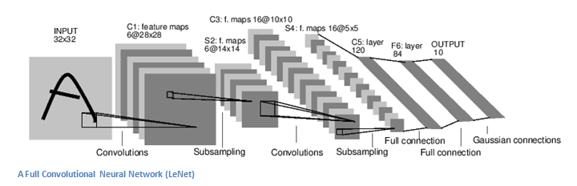

由于计算资源等原因，CNN在很长时间内处于被遗忘的状态。二十多年后的ImageNet比赛中，基于CNN的AlexNet在比赛中大放异彩，并引领了CNN的复兴，此后CNN的研究进入了高速发展期。目前卷积神经网络的发展有两个主要方向：
- 如何提高模型的性能。这个方向的一大重点是如何训练更宽、更深的网络。沿着这一思路涌现出了包括GoogleNet,VGG，ResNet，ResNext在内的很多经典模型。
- 如何提高模型的速度。提高速度对CNN在移动端的部署至关重要。通过去掉max pooling，改用stride卷积，使用group卷积，定点化等方法，人脸检测、前后背景分割等CNN应用已经在手机上大规模部署。

目前，CNN是计算机视觉领域最重要的算法，在很多问题上都取得了良好的效果。因为篇幅关系，本文将主要介绍卷积神经网络的基础知识。

## 神经网络 vs 卷积神经网络
上篇文章中我们介绍了神经网络。神经网络在大数据处理，语言识别等领域都有着广泛的应用。但在处理图像问题时会许多问题：
- 参数爆炸
以200x200x3的图像为例，如果输入层之后的hidden layer有100个神经元，那么参数量会达到200x200x3x100=1200万。显然有如此多参数的模型是难以训练且容易过拟合的。
- 平移不变性
对很多图像问题，我们希望模型满足一定的平移不变性。 例如对图像分类问题，我们希望物体出现在图片的任何位置上，模型都能正确识别出物体。
- 局部相关性
在大数据等问题中，输入维度之间不存在显式的拓扑关系，因此适合使用神经网络（全连接层）进行建模。但对于计算机视觉的问题，输入图片的相邻像素之间存在天然的拓扑关系。例如，判断图片中某个位置是否有物体时，我们只需要考虑这个位置周边的像素就可以了，而不需要像传统神经网络那样将图片中所有像素的信息作为输入。

为了克服神经网络的上述问题，在视觉领域，我们需要一种更合理的网络结构。卷积神经网络，在设计时通过局部连接和参数共享的方式，克服了神经网络的上述问题，因而在图像领域取得了惊人的效果。接下来我们将详细介绍卷积神经网络的原理。

## 卷积神经网络
### 网络结构
卷积神经网络和传统神经网络的整体结构大致相同。如下图所示，含有2层全连接层的传统神经网络和含有2层卷积层的卷积神经网络都是由基本单元堆叠而成，前一层的输出作为后一层的输入。最终层的输出，作为模型的预测值。二者的主要差别在于基本单元不同，卷积神经网络使用卷积层代替了神经网络中的全连接层。
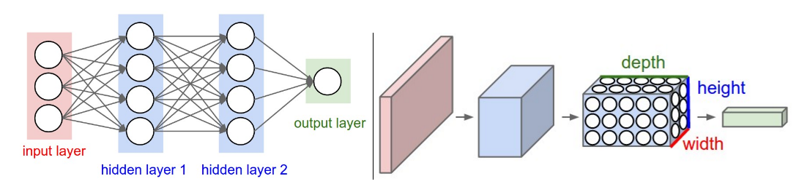
和全连接层一样，卷积层中也含有可以学习的参数weight和bias。模型的参数，可以按上一篇文章介绍的方法，在监督学习的框架下定义损失函数，通过反向传播进行优化。

### 卷积 (Convolution)
卷积层是整个卷积神经网络的基础。2D卷积操作，可以看作是一个类似模板匹配的过程。如下图所示，将尺寸为  的模板，通过滑动窗口的方式和输入进行匹配。滑动过程中，输入中对应位置的值和模板的权重的内积加一个偏移量，作为对应输出位置的值。，是模板的大小，统称为kernel size，在CNN中，和一般会取相同的值。是模板的channel数量，和输入的channel数相同，例如对RGB图像，channel数为3。
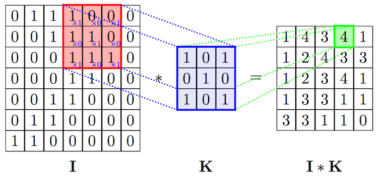

模板在卷积神经网络中常被称为卷积核（）或者过滤器（filter）。在标准卷积中，输出位置)对应的输出值可以表示成：

_{xy}=\sum_{i=1}^h\sum_{j=1}^w\sum_{k=1}^d{K_{ijk}\cdot{I_{x+i-1,y+j-1,k}}+b})


在CNN中，除了描述单个filter的，， 3个参数之外，还有3个重要的参数 depth, stride和 padding：
- depth指的是输出channel的数量,对应于卷积层中filter的数量
- stride指的是filter每次滑动的步长
- padding指的是在输入四周补0的宽度。使用padding主要是为了控制输出的尺寸。如果不添加padding，使用kernel size大于1的filter会使输尺寸出比输入小。在实际中经常会增加padding，使得输入和输出的尺寸一致。

如下图所示，对1D的情况，假设输入尺寸为，filter的尺寸为，stride为，padding为，那么输出的尺寸为 /S+1)为。 通过设定/2)，当时，输入和输出的尺寸会保持一致。2D卷积的计算和1D卷积类似。
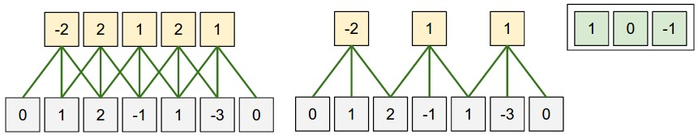

对比传统神经网络中的全连接层，卷积层实际上可以看成是全连接层的一种特例。首先是局部连接性，通过利用输入自带的空间拓扑结构，卷积神经网络只需考虑在空间上和输出节点距离在filter范围内的输入节点，其他边的权重都为0。此外，对于不同的输出节点，我们强制filter的参数完全一致。但通过这种**局部连接**和**参数共享**，卷积层可以更好的利用图像中内在的拓扑关系及平移不变形，大大减少了参数，从而得到一个更好的局部最优解，使其在图像问题上有更好的性能。

在tensorflow中实现卷积层非常简单，可以直接调用`tf.nn.conv2d`：
```
weight=tf.get_variable(shape=[kernel_size, kernel_size, input_size, depth]）
bias = tf.get_variable(shape=[depth])
conv = tf.nn.conv2d(x, weight, strides=[1, 1, 1, 1], padding='SAME')
conv_relu = tf.nn.relu(conv + bias)
```

### 池化 (Pooling)
在CNN网络中，除了大量的卷积层，我们也会根据需要，插入适量的池化层。池化层可以用来减少输入的尺寸，从而减少后续网络的参数与计算量。常见的池化操作（如max pooling，average pooling），通常也可以提供一定的平移不变性。

我们以max pooling举例，max pooling对kernel size范围内的所有值取max，结果作为对应位置的输出。pooling通常是对每个channel单独操作，因此输出的channel数和输入相同。池化层和卷积层类似，pooling操作也可以理解为采用滑动窗口的方式，因此也有和卷积对应的步长stride和padding等概念。 下图所示就是一个kernel size和stride都为2的max pooling操作：
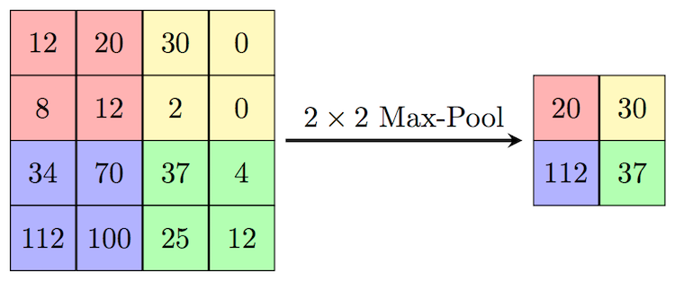

实际当中，池化层的参数有两种比较常见的配置，一种是kernel size和stride都为2的，这种设置池化过程中无重叠区域。另一种是kernel size为3，stride为2的有重叠pooling。在tensorflow中实现池化层也非常简单：
```
tf.nn.max_pool(x, ksize=[1, size, size, 1], strides=[1, stride, stride, 1], padding='SAME')  
```

### 卷积神经网络的经典网络结构
介绍了卷积神经网络的基本组成模块之后，我们接下来介绍一下卷积神经网络的经典网络结构。从1998的LeNet-5开始，到Imagenet 2012的AlexNet模型，再到后来的VGG等一系列经典模型，基本都遵从了这个经典结构。
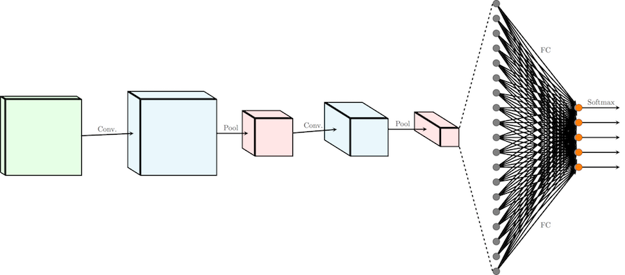

为了清晰，我们省略了卷积和全连接层之后的非线性激活函数。如上图所示，经典的卷积神经网络，可以分为三个部分：
- 一系列级联的conv+pooling层（有时会省略掉pooling层）。在级联的过程中，输入的尺寸逐渐变小，同时输出的channel逐渐变多，完成对信息从低级到高级的抽象。
- 一系列级联的全连接层。在卷积层到全连接层的交界处，卷积层的输出转化成一维的输入送入全连接层。之后根据任务的复杂程度，级联一系列全连接层。
- 最后的输出层，根据任务的需要，决定输出的形式。 如多分类问题，最后会接一个softmax层。

经典卷积神经网络，可以看作是一个输出尺寸固定的非线性函数。它可以将尺寸为 的输入图片转化为最终的维度为的定长向量。经典卷积神经网络在图像分类、回归等问题上取得了巨大的成功。之后的实战部分，我们会给出一个回归问题的例子。


## 全卷积网络（Fully Convolution Network）
经典的卷积神经网络中由于有全连接层的存在，只能接受固定尺寸的图片作为输入，并产生固定尺寸的输出。虽然可以通过使用adaptive pooling的方式， 接受变长的输入，但这种处理仍然只能产生固定尺寸的输出。为了克服经典卷积神经网络的这种缺点，在物体分割等输出尺寸可变的应用场景下，我们不再使用全连接层。这种主要计算单元全部由卷积层组成的网络，被称为全卷积网络（FCN）。

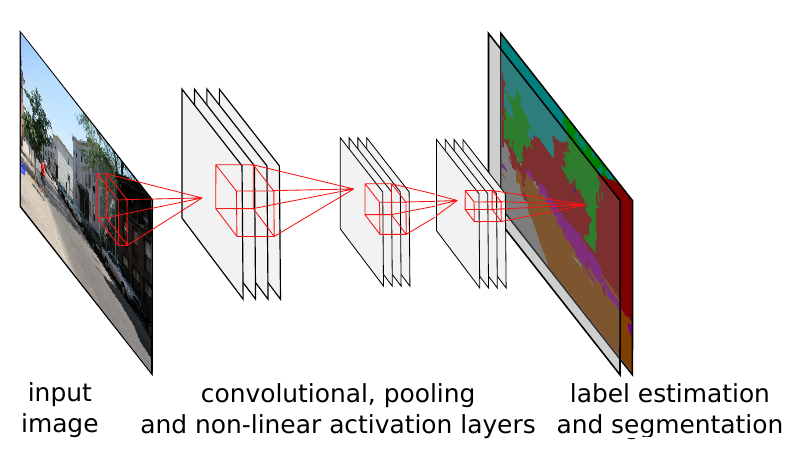
如上图所示，由于卷积操作对输入尺寸无限制，且输出尺寸由输入决定，因此全卷积网络可以很好的处理如分割等尺寸不固定的问题。全卷积网络，可以看成是一种输出尺寸随输入尺寸线性变化的非线性函数。它可以将尺寸为  的输入图片转化为最终维度为的输出。 可以转化为这种形式的监督学习问题，基本都可以在全卷积网络的框架下求解。


### 反卷积（Deconvolution）
在全卷积网络中，标准的卷积+池化操作，会使输出的尺寸变小。对于很多问题，我们需要输出的尺寸和输入图片保持一致，因此我们需要一种可以扩大输入尺寸的操作。最常用的操作就是反卷积。

反卷积可以理解成卷积的逆向操作。这里我们主要介绍stride>1且为整数的反卷积。这种反卷积可以理解为一种广义的差值操作。以下图为例，输入是3x3的绿色方格，反卷积的stride为2，kernel size为3，padding为1。在滑动过程中，对每个输入方格，其输出为对应的3x3阴影区域，输出值为输入值和kernel对应位置值的乘积。最终的输出为滑动过程中每个输出位置对应值的累加和。这可以看成是一种以3x3 kernel值为权重的差值操作。最外边的一圈白色区域无法进行完整的差值操作，因此可以通过设定padding为1,将周围的一圈白色区域去掉，最终的输出尺寸为5x5。


根据上面的描述，stride>1且为整数的反卷积，如果固定反卷积kernel的取值为双线性差值kernel，反卷积可以等价于双线性差值。而通过学习得到反卷积kernel，相比固定参数的kernel，可以更好的适应不同的问题，因此反卷积可以看成是传统差值的一种推广。和卷积类似，tensorflow中已经实现了反卷积模块`tf.layers.conv2d_transpose`。

## 卷积神经网络在视觉识别中的应用
CNN在视觉识别（Visual Recognition）中有着非常广泛的应用。我们接下来以视觉识别中的三大经典问题：分类/回归、检测和分割为例，介绍如何用CNN解决实际问题。
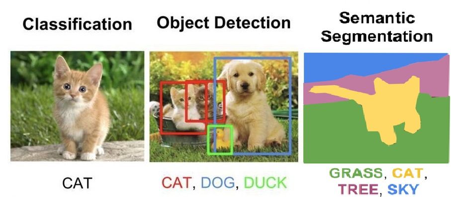

#### 分类/回归 （classification/regression）
图像分类是指判别图像属于哪一/哪些预先指定的类别，图像回归是指根据图像内容判断图片属性的取值。分类和回归在实际中都有着广泛的应用。从物体分类，人脸识别，再到12306的验证码识别等，都可以抽象成标准的分类问题。类似的，人脸的关键点位置预测，人脸的属性预测（如年龄，颜值）等，也都可以抽象为标准的回归问题。目前视觉领域的应用，如果能抽象成输出为定长的分类或者回归问题，在有大量训练数据的情况下，通常都可以采用之前介绍的经典卷积神经网络框架解决。

#### 检测 （detection）
检测问题通常是指判断出图片中是否有物体，以及该物体的位置。检测有one-stage和two-stage的方法。 因为篇幅关系，我们重点介绍在FCN框架下的one-stage方法。
按之前的介绍，FCN可以看作是将的输入图片，转化为输出的非线性函数。在FCN的框架下解决检测问题，我们可以预测每一个输出位置是否有物体，以及物体左上角、右下角相对于当前输入位置的偏移。 这样对每个输出位置，需要5维的向量来表示是否有物体，即d=5。 定义了网络的输出之后，我们人工构造出对应的ground truth，之后在监督学习的框架下，通过定义损失函数（l2 loss)并进行反向传播，进行参数的学习。

#### 分割 （segmentation）
分割问题是指给出图片中每个像素点的类别。 基于FCN的分割方法和上面介绍的one-stage的检测方法非常类似。 对一个多分类的分割问题，对输出的每一个位置，我们可以判断其所属的类别。 在FCN的框架下，对于N分类问题，输出为。之后通过反向传播的方式进行训练。 分割和检测问题有一个区别是我们有时需要得到和输入图片同样大小的输出（)，但卷积神经网络为了加速，通常会添加pooling层，减小中间卷积层的尺寸。 如下图所示，为了保证输出的尺寸满足要求，我们可以在网络的最后添加反卷积层进行补偿，从而获得更大尺寸的输出。
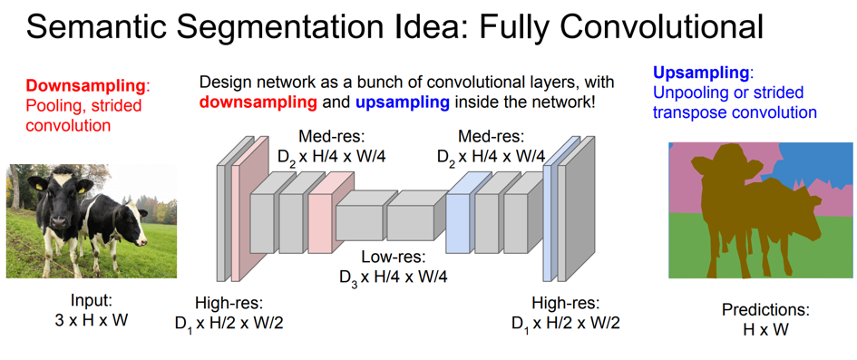

## 实战： 人脸关键点检测
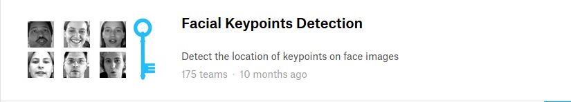

人脸关键点检测是现在视觉领域比较成熟的一项应用，是活体检测，人类美化，人脸识别等高级应用的基础。本文最后通过一个人脸关键点检测的例子，展示如何用Tensorflow实现图像回归类的应用。实验数据集采用Kaggle比赛中的[Faical Kerypoints Detection](https://www.kaggle.com/c/facial-keypoints-detection)数据集。该数据集包含了7094张训练图片和1783张测试图片。数据集中的每一张人脸都有15个关键点的标注，图片的尺寸为96x96。

### L2距离回归
Kaggle比赛的目标是预测人脸上15个关键点的坐标，总共30个float值，属于标准的回归问题。我们选择采用最常见的l2距离，作为优化的目标。和第一篇文章中神经网络模型的代码结构一样，我们将代码分成了3个主要模块，分别是Dataset模块，Net模块和Solver模块。

#### 模型结构

- ```inference```
我们在inference函数中定义网络的主体结构。因为模型会重复用到全连接层和卷积层，因此我们将他们封装成函数`linear_relu`和`conv_relu`，从而方便复用代码。 网络结构上我们采用了比较简单的3层卷积，2层全连接的结构。卷积层的输出通过`tf.reshape`转化成了全连接层可以接受的格式。因为是回归问题，我们直接将最后一层全连接层的结果作为输出。

- ```loss```
为了简单，对于标准的回归问题，我们使用mse作为损失函数`tf.reduce_mean(tf.square(predictions - labels), name='mse')`

- ```metric```
测试时，我们依旧使用tensorflow提供了tf.metrics模块，自动完成对每个batch的评价，并将所有的评价汇总。在这个例子里，我们是解决回归问题，因此可以使用`tf.metrics.mean_squared_error`计算均方误差。
```
def linear(x, output_size, wd=0):

  input_size = x.get_shape()[1].value
  weight = tf.get_variable(
      name='weight',
      shape=[input_size, output_size],
      initializer=tf.contrib.layers.xavier_initializer())
  bias = tf.get_variable(
      'bias', shape=[output_size], initializer=tf.constant_initializer(0.0))
  out = tf.matmul(x, weight) + bias

  if wd != 0:
    weight_decay = tf.multiply(tf.nn.l2_loss(weight), wd, name='weight_loss')
    tf.add_to_collection('losses', weight_decay)

  return out


def linear_relu(x, output_size, wd=0):
  return tf.nn.relu(
      linear(x, output_size, wd), name=tf.get_default_graph().get_name_scope())


def conv_relu(x, kernel_size, width, wd=0):

  input_size = x.get_shape()[3]
  weight = tf.get_variable(
      name='weight',
      shape=[kernel_size, kernel_size, input_size, width],
      initializer=tf.contrib.layers.xavier_initializer())
  bias = tf.get_variable(
      'bias', shape=[width], initializer=tf.constant_initializer(0.0))
  conv = tf.nn.conv2d(x, weight, strides=[1, 1, 1, 1], padding='SAME')

  if wd != 0:
    weight_decay = tf.multiply(tf.nn.l2_loss(weight), wd, name='weight_loss')
    tf.add_to_collection('losses', weight_decay)

  out = tf.nn.relu(conv + bias, name=tf.get_default_graph().get_name_scope())
  return out


def pool(x, size):
  return tf.nn.max_pool(
      x, ksize=[1, size, size, 1], strides=[1, size, size, 1], padding='SAME')
```

```
class BasicCNN(Net):

  def __init__(self, **kwargs):
    self.output_size = kwargs.get('output_size', 1)
    return

  def inference(self, data):

    with tf.variable_scope('conv1'):
      conv1 = conv_relu(data, kernel_size=3, width=32)
      pool1 = pool(conv1, size=2)

    with tf.variable_scope('conv2'):
      conv2 = conv_relu(pool1, kernel_size=2, width=64)
      pool2 = pool(conv2, size=2)

    with tf.variable_scope('conv3'):
      conv3 = conv_relu(pool2, kernel_size=2, width=128)
      pool3 = pool(conv3, size=2)

    # Flatten convolutional layers output
    shape = pool3.get_shape().as_list()
    flattened = tf.reshape(pool3, [-1, shape[1] * shape[2] * shape[3]])

    # Fully connected layers
    with tf.variable_scope('fc4'):
      fc4 = linear_relu(flattened, output_size=100)

    with tf.variable_scope('fc5'):
      fc5 = linear_relu(fc4, output_size=100)

    with tf.variable_scope('out'):
      prediction = linear(fc5, output_size=self.output_size)

    return {"predictions": prediction, 'data': data}

  def loss(self, layers, labels):
    predictions = layers['predictions']
    with tf.variable_scope('losses'):
      loss = tf.reduce_mean(tf.square(predictions - labels), name='mse')
    return loss

  def metric(self, layers, labels):
    predictions = layers['predictions']
    with tf.variable_scope('metrics'):
      metrics = {
        "mse": tf.metrics.mean_squared_error(
          labels=labels, predictions=predictions)}
    return metrics
```
#### Dataset
```
images = np.vstack(df['Image'].values) / 255.  # scale pixel values to [0, 1]
images = images.astype(np.float32)

label = df[df.columns[:-1]].values
label = (label - 48) / 48  # scale target coordinates to [-1, 1]
label = label.astype(np.float32)
```

```
def parse_example(example_proto):
  features = {
      "data": tf.FixedLenFeature((9216), tf.float32),
      "label": tf.FixedLenFeature((30), tf.float32, default_value=[0.0] * 30),
  }
  parsed_features = tf.parse_single_example(example_proto, features)
  image = tf.reshape(parsed_features["data"], (96, 96, -1))
  return image, parsed_features["label"]


dataset = tf.contrib.data.TFRecordDataset(files)
dataset = dataset.map(self.parse_function)
```
Dataset部分，我们使用了tensorflow推荐的tfrecord格式。通过`TFRecordDataset`函数读取tfrecord文件，并通过`parse_example`将tfrecod转换成模型的输入格式。tfrecord作为一种定长格式，可以大大加快数据的读取速递。特别在使用GPU时，可以防止数据io成为性能的瓶颈。

#### Solver
通过模块化的设计，我们可以完全复用第一篇文章中的Solver代码，而不需要任何修改，进而提高代码的复用效率。

#### 实验结果

```
file_dict = {
    'train': os.path.join(args.data_dir, 'train.tfrecords'),
    'eval': os.path.join(args.data_dir, 'test.tfrecords')
}

with tf.Graph().as_default():
  dataset = Dataset(
      file_dict=file_dict,
      split='train',
      parse_function=parse_example,
      batch_size=50)
  net = Net(output_size=30)
  solver = Solver(dataset, net, max_steps=200, summary_iter=10)
  solver.train()
```

封装好借口之后，我们可以通过上面简单的代码，完成模型的训练。下图是tensorboad中可视化的网络结构、loss的统计以及模型在测试图片上的效果：
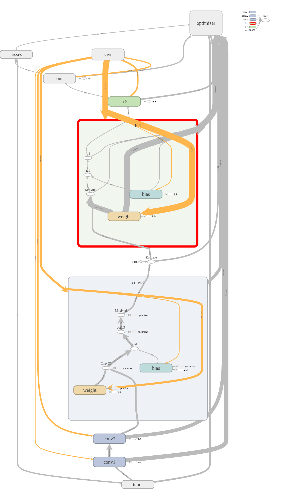

```
step     10: loss = 0.0756 (136.2 examples/sec)
step     20: loss = 0.0230 (155.2 examples/sec)
step     30: loss = 0.0102 (149.1 examples/sec)
step     40: loss = 0.0071 (125.1 examples/sec)
step     50: loss = 0.0065 (160.9 examples/sec)
step     60: loss = 0.0081 (171.9 examples/sec)
step     70: loss = 0.0058 (148.4 examples/sec)
step     80: loss = 0.0060 (169.4 examples/sec)
step     90: loss = 0.0069 (185.4 examples/sec)
step    100: loss = 0.0057 (186.1 examples/sec)
step    110: loss = 0.0062 (183.8 examples/sec)
step    120: loss = 0.0080 (170.3 examples/sec)
step    130: loss = 0.0052 (185.8 examples/sec)
step    140: loss = 0.0071 (184.3 examples/sec)
step    150: loss = 0.0049 (170.7 examples/sec)
step    160: loss = 0.0056 (178.7 examples/sec)
step    170: loss = 0.0053 (173.2 examples/sec)
step    180: loss = 0.0058 (172.6 examples/sec)
step    190: loss = 0.0053 (172.5 examples/sec)
step    200: loss = 0.0056 (188.1 examples/sec)

mse: 0.140243709087
```
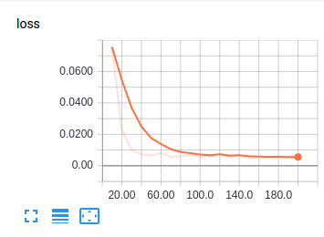
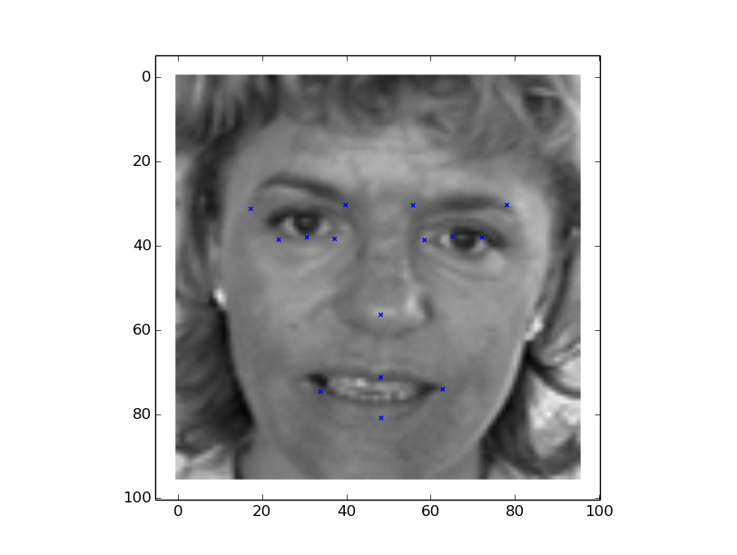

可以看到，一个3层卷积+2层全连接的经典卷积神经网络，就可以很好的解决人脸关键点检测的问题。在实际中，我们可以使用更复杂的网络和一些其他trick来进一步提高模型性能。

完整代码下载：<https://github.com/Dong--Jian/Vision-Tutorial>
